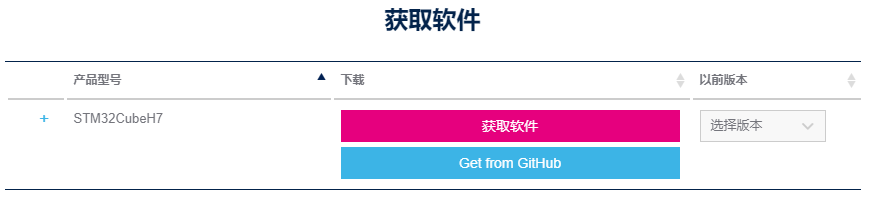

# STM32H750VBTx_Example
STM32H750VBTx 例程

[TOC]


# 一、开发环境

## 1. STM32Cube MCU包

固件库版本：STM32Cube_FW_H7_V1.8.0

下载地址：[https://www.st.com/zh/embedded-software/stm32cubeh7.html](https://www.st.com/zh/embedded-software/stm32cubeh7.html)



解压文件，到下图中路径“C:\Users\xxx\STM32Cube\Repository\STM32Cube_FW_H7_V1.8.0”，如无对应路径自己创建。


## 2. STM32CubeMX

版本：STM32CubeMX v6.1.1

下载地址：[https://www.st.com/content/st_com/en/products/development-tools/software-development-tools/stm32-software-development-tools/stm32-configurators-and-code-generators/stm32cubemx.html](https://www.st.com/content/st_com/en/products/development-tools/software-development-tools/stm32-software-development-tools/stm32-configurators-and-code-generators/stm32cubemx.html)


下载文件后，解压，运行“SetupSTM32CubeMX-6.1.1.exe”


默认安装即可


设置固件包路径，“Help”->“Updater Settings”->“Firmware Repository”->“Repository Folder”->“C:/Users/zhou/STM32Cube/Repository/”


## 3. Keil uVision5 v5.31.00

版本：Keil uVision5 v5.31.00

下载地址：[https://www.keil.com/download/product/](https://www.keil.com/download/product/)

[https://armkeil.blob.core.windows.net/eval/MDK531.EXE](https://armkeil.blob.core.windows.net/eval/MDK531.EXE)

默认安装

安装完成后不要打开，直接关闭。


## 4. Keil.STM32H7xx_DFP.2.7.0.pack

MDK软件支持包

版本：Keil.STM32H7xx_DFP.2.7.0.pack

下载地址：[https://www.keil.com/dd2/pack/](https://www.keil.com/dd2/pack/)

[https://keilpack.azureedge.net/pack/Keil.STM32H7xx_DFP.2.7.0.pack](https://keilpack.azureedge.net/pack/Keil.STM32H7xx_DFP.2.7.0.pack)


# 二、例子

## 1. 时钟配置

STM32Cube 是一个全面的软件平台，包括了ST产品的每个系列。平台包括了STM32Cube 硬件抽象层(一个STM32抽象层嵌入式软件，确保在STM32系列最大化的便携性)和一套的中间件组件(RTOS, USB, FatFs, TCP/IP, Graphics, 等等).

- 直观的STM32微控制器的选择和时钟树配置
- 微控制器图形化配置外围设备和中间件的功能模式和初始化参数
- C代码生成项目覆盖STM32微控制器的初始化符合IAR™，Keil的™和GCC编译器。


对于新的产品设计，我们强烈推荐使用STM32Cube来加速你的开发过程，并为以后的产品平台移植打下良好的基础。

### a.新建工程
打开STM32cubeMX软件，点击“File”->“New Project”。选择对应MCU（STM32H750VBTx）。点击“Start Project”


### b. RCC设置
​	“Categories”->“System Core”->“RCC”
​	HSE(外部高速时钟)选为Crystal/Ceramic Resonator(晶振/陶瓷谐振器)
​	LSE(外部低速时钟)选为Crystal/Ceramic Resonator(晶振/陶瓷谐振器)


```
- 选项 High Speed Clock（HSE）用来配置 HSE
- 选项 Low Speed Clock（LSE）用来配置 LSE
- 选项 Master Clock Output 1 用来选择是否使能 MCO1 引脚时钟输出
- 选项 Master Clock Output 2 用来选择是否使能 MCO2 引脚时钟输出
- 最后一个选项 Audio Clock Input（I2S_CKIN）用来选择是否从 I2S_CKIN(PC9)输入I2S 时钟。
- 要注意，因为选项 Master Clock Output 2 和选项 Audio Clock Input （I2S_CKIN）都是使用的 PC9 引脚，所以如果我们使能了其中一个，那么另一个选项会自动显示为红色，也就是不允许配置，这就是 STM32CubeMX 的自动冲突检测功能.
```


### c. 时钟配置

点击“Clock Configuration”，进入时钟配置界面。

第一步配置系统时钟为400MHz。


```
1. 时钟源参数设置： HSE 或者 HSI 配置。这里我们选择 HSE 为时钟源，所以我们之前必须在 RCC 配置中我们开启 HSE。
2. 时钟源选择： HSE 还是 HSI。这里我们配置选择器选择 HSE 即可。
3. PLL 分频系数 M 配置。分频系数 M 我们设置为 3。
4. 主 PLL 倍频系数 N 配置。倍频系数 N 我们设置为 100。
5. 主 PLL 分频系数 P 配置。分频系数 P 我们配置为 2。
6. 系统时钟时钟源选择： PLL,HSI 还是 HSE。这里毫无疑问，我们选择 PLL，选择器选择 PLLCLK 即可。
7. 经过上面配置以后此时 SYSCLK=400Mhz。(24MHz / 3 * 100 / 2 = 400MHz)
```


第二步配置 AHB，APB1、APB2、 APB3、 APB4 和 Systick 的分频系数 


```
AHB、APB1、APB2、APB3 和 APB 总线时钟以及 Systick 时钟的最终来源都是系统时钟SYSCLK。
其中 AHB 总线时钟 HCLK 是由 SYSCLK 经过 AHB 预分频器之后的来，要设置 HCLK 为 200MHz，只需要配置图中左侧红框为 2 即可。
得到 HCLK 之后，接下来我们将在图中右侧红框处依次配置 APB3、 APB1、 APB2 和 APB4 分频系数分别为 2、 2、 2 和 2 即可。
注意！ systick 固定为 400MHz，配置完成之后，那么 HCLK=200MHZ， Systic=400MHz， PCLK1=100MHz， PCLK2=100MHz， PCLK3=100Mhz, PCLK4=100MHz。
```

### d. Cortex-M7 内核基本配置  

第一个配置栏目 Cortex Interface Settings 下面有两个配置项：
	1) CPU ICache：使能 I-Cache。
	2) CPU DCache: 使能 D-Cache。
上面这 2 个参数是 CM7 内核相关配置。 第二个配置栏目 Cortex Memory Protection Unit，是用来配置内存保护单元 MPU。


### e. 外设初始化为独立文件

“Proje Manager” -> “Generated files” -> “勾选Generated periphera initialization as a pair of '.c/.h' files per IP”。外设初始化为独立的C文件和头文件。


### f. 配置生成的工程类型


至此配置完毕，保存工程。


## 2. IO输出

### a. 配置PA15

“Pinout & Configuration” -> “Categories” -> “System Core” -> “GPIO”，输入管脚号，找到管脚所在的位置


左键，设置IO为“GPIO_Output”模式。


### b. IO详细配置

进入 IO 口详细配置界面，界面会列出所有使用到的 IO 口的参数配置。选择PA15，就会在显示框下方显示对应的 IO 口详细配置信息，  


### c. 生成工程代码

在 STM32CubeMX 操作界面右上角，点击 CREATE CODE 即可生成源码 ，打开工程。


### d. 修改代码 

增加代码，使LED闪烁


```c
    HAL_GPIO_WritePin(RUN_LED_GPIO_Port, RUN_LED_Pin, GPIO_PIN_SET);
    HAL_Delay(1000);
    HAL_GPIO_WritePin(RUN_LED_GPIO_Port, RUN_LED_Pin, GPIO_PIN_RESET);
    HAL_Delay(1000);
```

### e. 编译运行

编译工程，选择下载器，下载程序运行。RUN_LED闪烁。

## 3. 串口

### a. 配置串口1，异步通讯模式，使用PA9、PA10管脚。


- 点击USATR1  
- 设置MODE为**Asynchronous(异步通信)**
- GPIO引脚设置 PA10->USART1_RX、PA9->USART_TX

### b. 配置串口参数

波特率为115200 Bits/s。传输数据长度为8 Bit。奇偶检验无。停止位1。其余默认即可。


### c. NVIC Settings(中断配置)

使能接收中断(中断优先级默认即可)


### d. 生成工程


### e. 包含头文件

uart.h文件中，在 / * USER CODE BEGIN Includes * /  / * USER CODE END Includes * / 添加如下内容

```c
/* USER CODE BEGIN Includes */
#include <stdio.h>
/* USER CODE END Includes */
```

### f. 映射printf函数

在uart.c的 / * USER CODE BEGIN 0 * /  / * USER CODE END 0 * / 中间，添加如下内容

```c
/* USER CODE BEGIN 0 */
//加入以下代码,支持printf函数,而不需要选择use MicroLIB	  
#if 1
#pragma import(__use_no_semihosting)  
//解决HAL库使用时,某些情况可能报错的bug
int _ttywrch(int ch)    
{
    ch=ch;
	return ch;
}

//标准库需要的支持函数                 
struct __FILE 
{ 
	int handle; 
	/* Whatever you require here. If the only file you are using is */ 
	/* standard output using printf() for debugging, no file handling */ 
	/* is required. */ 
};

/* FILE is typedef’ d in stdio.h. */ 
FILE __stdout; 

//定义_sys_exit()以避免使用半主机模式    
void _sys_exit(int x) 
{ 
	x = x; 
} 
//重定义fputc函数 
int fputc(int ch, FILE *f)
{      
	while((USART1->ISR&0X40)==0);//循环发送,直到发送完毕   
	USART1->TDR = (uint8_t) ch;      
	return ch;
}
#endif 
/* USER CODE END 0 */
```

### g. 输出测试

在main.c中主循环中添加printf输出


### h. 配置串口中断接收

i. 定义串口接收Buf

```c
/* uart.h */
/* USER CODE BEGIN Private defines */
#define USART_RX_BUFFER_SIZE              (1)        	// 缓存接收多少数据产生一次中断
extern uint8_t g_UartRxBuffer [USART_RX_BUFFER_SIZE];	// 串口接收缓冲
/* USER CODE END Private defines */

/* uart.c */
/* USER CODE BEGIN 0 */
uint8_t g_UartRxBuffer [USART_RX_BUFFER_SIZE];			// 串口接收缓冲
/* USER CODE END 0 */
```


ii. 修改中断服务程序，stm32h7xx_it.c->void USART1_IRQHandler(void)

```c
/* Private includes ----------------------------------------------------------*/
/* USER CODE BEGIN Includes */
#include "usart.h"
/* USER CODE END Includes */

/* Private define ------------------------------------------------------------*/
/* USER CODE BEGIN PD */
#define USART_MAX_DELAY  (0x1FFFF)  // 串口处理的最大超时
/* USER CODE END PD */


/**
  * @brief This function handles USART1 global interrupt.
  */
void USART1_IRQHandler(void)
{
  /* USER CODE BEGIN USART1_IRQn 0 */
  // 前面板-调试串口
  uint32_t timeout = 0;
  /* USER CODE END USART1_IRQn 0 */
  HAL_UART_IRQHandler(&huart1);
  /* USER CODE BEGIN USART1_IRQn 1 */
  timeout = 0;
  while (HAL_UART_GetState(&huart1) != HAL_UART_STATE_READY) { //等待就绪
    timeout++;        //超时处理
    if(timeout > USART_MAX_DELAY) {
      break;
    }      
  }
     
  timeout = 0;
  //一次处理完成之后，重新开启中断并设置RxXferCount大小
  while(HAL_UART_Receive_IT(&huart1, (uint8_t *)g_UartRxBuffer, FORNT_DEBUG_USART1_RX_BUFFER_SIZE) != HAL_OK) {
    timeout++; //超时处理
    if(timeout > USART_MAX_DELAY) {
      break;
    }      
  }
  /* USER CODE END USART1_IRQn 1 */
}
```


iii. 添加串口接收中断回调函数

uart.c的 / * USER CODE BEGIN 1 * /  / * USER CODE END 1 * /之间，添加代码。

```c
/* USER CODE BEGIN 1 */
/**
  * @brief Rx Transfer completed callbacks
  * @param huart: uart handle
  * @retval None
  */
void HAL_UART_RxCpltCallback(UART_HandleTypeDef *huart)
{
  /* Prevent unused argument(s) compilation warning */
  UNUSED(huart);
  
  /* NOTE : This function should not be modified, when the callback is needed,
            the HAL_UART_RxCpltCallback can be implemented in the user file
  */

  if(huart->Instance==USART1) {    //调试串口1
    // 收到数据后再发送回去
    HAL_UART_Transmit(&huart1, (uint8_t *)g_UartRxBuffer, sizeof(g_UartRxBuffer), 0xFFFF);
  }
}
/* USER CODE END 1 */
```

iv. 初始开启中断

main.c

```c
  /* USER CODE BEGIN 2 */
  printf("\r\n-----------------------------------------\r\n");
  printf("-------- MCUB STM32H750VBTx Init --------\r\n");
  printf("-----------------------------------------\r\n");

  HAL_UART_Receive_IT(&huart1, (uint8_t *)g_UartRxBuffer, sizeof(g_UartRxBuffer));
  /* USER CODE END 2 */
```

v. 中断接收配置完成


## 4. IO输入-轮询模式

### a. 配置PC0为GPIO_Input(输入模式)


### b. IO详细配置


### c. 生成工程 

GENERATE CODE

### d. 修改代码

main.c 主循环 添加代码，轮询读取IO状态

```c
printf("IN = %d\r\n", HAL_GPIO_ReadPin(InPut_GPIO_Port, InPut_Pin));
```


### e. 下载运行


## 5. IO输入-中断模式

### a. 配置PA3为“GPIO_EXIT3”


### b. IO详细配置


GPIO mode


| External Interrupt Made with Rising edge trigger detection | 具有上升沿触发检测的外部中断模式|
| ---- | ---- |
| External Interrupt Mode with Falling edge trigger detection | 具有下降沿触发检测的外部中断模式|
| External Interrupt Mode with Rising/Falling edge trigger detection | 具有上升/下降沿触发检测的外部中断模式 |
| External Event Mode with Rising edge trigger detection | 具有上升沿触发检测的外部事件模式 |
| External Event Mode with Falling edge trigger detection | 具有下降沿触发检测的外部事件模式 |
| External Event Mode with Rising/Falling edge trigger detection | 具有上升/下降沿触发检测的外部事件模式 |

### c. 开启中断


### d. 生成工程

GENERATE CODE

### e. 修改代码

增加GPIO外部中断回调函数

```c
/* gpio.h */
/* USER CODE BEGIN Includes */
#include <stdio.h>
/* USER CODE END Includes */
/* USER CODE BEGIN Prototypes */
void HAL_GPIO_EXTI_Callback(uint16_t GPIO_Pin);
/* USER CODE END Prototypes */


/* gpio.c */
/* USER CODE BEGIN 2 */
/**
  * @brief EXTI line detection callbacks
  * @param GPIO_Pin: Specifies the pins connected EXTI line
  * @retval None
  */
void HAL_GPIO_EXTI_Callback(uint16_t GPIO_Pin)
{
  if(GPIO_Pin == InPut3_Pin) {
    printf("FORNT_INPUT_3_Pin\r\n");
  }  
}
/* USER CODE END 2 */
```

### f. 下载运行


## 6. 定时器

### a. 时钟

根据之前的时钟配置：定时器的时钟频率为200Mhz


### b. 定时器Mode配置


- **Slave Mode:**主从模式，一般用不到，默认即可。
- **Trigger Source:**一般用不到，默认即可。
- **Clock Source:**时钟来源，选择“Internal Clock”(内部时钟)
  - 选项 ：Internal Clock 内部时钟
  - 选项 ： ETR2 外部触发输入(ETR)(****仅适用****TIM2,3,4)
- 其余项：默认设置即可

### c. 定时器Configuration配置


- **Prtscaler (定时器分频系数) :** 2000-1
- **Counter Mode(计数模式)：**Up(向上计数模式)      
- **Counter Period(自动重装载值) :  **100000-1   
- **CKD(时钟分频因子) ：** No Division 不分频
  - 选项： 可以选择二分频和四分频             
- **auto-reload-preload(自动重装载) :**  Enable 使能
- **TRGO Parameters**  触发输出 (TRGO)        不使能  
- TRGO：  定时器的触发信号输出 在定时器的定时时间到达的时候输出一个信号(如：定时器更新产生TRGO信号来触发ADC的同步转换，) 

$T_{out} = 1 / \frac{T_{clk}}{(psc+1)} * (arr + 1) = (arr + 1)*(psc+1)/T_{clk}$

arr=100000-1  psc=2000-1 Tclk=200Mhz    Tout = (100000*2000)/200MHz = 1000000us = 1s

### d. 开启中断


### e. 生成工程

GENERATE CODE

### f. 修改代码

关闭main.c主循环中对RUN_LED的控制

time增加代码

```c
/* time.h */
/* USER CODE BEGIN Includes */
#include "gpio.h"
/* USER CODE END Includes */
/* USER CODE BEGIN Prototypes */
void HAL_TIM_PeriodElapsedCallback(TIM_HandleTypeDef *htim);
/* USER CODE END Prototypes */

/* timer.c */
/* USER CODE BEGIN 1 */
/**
  * @brief  Period elapsed callback in non blocking mode
  * @param  htim: TIM handle
  * @retval None
  */
void HAL_TIM_PeriodElapsedCallback(TIM_HandleTypeDef *htim)
{
  if (htim->Instance == htim2.Instance) {
    printf("Timer2\r\n");
    HAL_GPIO_TogglePin(RUN_LED_GPIO_Port, RUN_LED_Pin);		//toggle the pin
  }
}
/* USER CODE END 1 */
```

main.c增加代码

```c
  /* USER CODE BEGIN 2 */
  /* Start the Timer2 */
  HAL_TIM_Base_Start_IT(&htim2);
  /* USER CODE END 2 */
```

### g. 下载运行


## 7. 独立看门狗

### a. 时钟

IWDG时钟为32KHz


### b. 配置IWDG1


- IWDG的时钟为32kHz,此时设置计数器时钟为32分频，则分频后的时钟频率为1KHz。
- IWDG窗口值（windows value）为默认不修改。当计数器的值大于窗口值时，如果执行重载操作，则会产生复位。
- 递减基础器重载值（down-counter reload value）配置为1000，即1000ms不刷新IWDG系统复位。

### c. 生成工程

GENERATE CODE

### d. 修改代码

main.c 主循环，增加每隔500ms，喂狗。

```c
/* Infinite loop */
  /* USER CODE BEGIN WHILE */
  while (1)
  {
    HAL_IWDG_Refresh(&hiwdg1);
    HAL_Delay(500);
    /* USER CODE END WHILE */
    /* USER CODE BEGIN 3 */
  }
  /* USER CODE END 3 */
```

### f. 下载运行


## 7. CAN

传统CAN模式

### a. 使能CAN1


### b. 配置GPIO

- PB8->FDCAN1_RX
- PB9->FDCAN1_TX


### c.时钟


CAN时钟为20MHz

### d. Can配置


- Frame Format：

  - Classic mode	传统CAN模式
  - FD mode with BitRate Switching
  - FD mode without BitRate Switching

- Mode

  - Normal mode 正常模式：正常收发
  - Bus Monitoring mode 总线监控模式：只收不发，监控总线报文
  - Internal LoopBack mode 内部回环测试：一般是验证下节点的收发是否有问题
  - External LoopBack mode 外部回环测试
  
- Auto Retranmission 自动重传，当总线出现仲裁发送失败时候，在空闲时会自动重传上一帧报文

- Transmit pause 发送暂停，这个配置对于一些特殊处理比较有用，在指定的时候暂停发送，这里初始化并不需要暂停发送

- Protocol Exception 协议异常处理功能，这个功能的意思是使能该协议异常处理时，在接收帧数据过程中检测到隐性的保留位时， 该功能将使操作状态转变为 IDLE 并在下一个采样点中止当前帧。反之禁用此功能的话，隐性的保留位将被视为格式错误，并当做错误帧来进行处理，也可以使能相关中断自己处理。

- Nominal Prescaler = 1；Nominal Sync Jump Width = 8；Nominal Time Seg1 = 31；Nominal Time Seg2 = 8；

  波特率Baud = (fdcan_sclk / (seg1 + seg2 + 1)) * prescaler；即波特率为500K

- Rx Fifo0 Elmts Nbr = 1

- Tx Fifo Queue Elmts Nbr = 1

- 其余默认

### e. 开启中断

选择“FDCAN1 interrupt 0”


### f. 生成工程

GENERATE CODE

### g. 修改代码

fdcan

```c
/* fdcan.h */
/* USER CODE BEGIN Includes */
#include <stdio.h>
/* USER CODE END Includes */
/* USER CODE BEGIN Prototypes */
uint8_t FDCAN1_Send_Msg(uint8_t* msg, uint32_t len);
void HAL_FDCAN_RxFifo0Callback(FDCAN_HandleTypeDef *hfdcan, uint32_t RxFifo0ITs);
/* USER CODE END Prototypes */

/* fdcan.c */
/* USER CODE BEGIN 1 */
//can发送一组数据(固定格式:ID为0X12,标准帧,数据帧)	
//len:数据长度(最大为8),可设置为FDCAN_DLC_BYTES_2~FDCAN_DLC_BYTES_8				     
//msg:数据指针,最大为8个字节.
//返回值:0,成功;
//		 其他,失败;
uint8_t FDCAN1_Send_Msg(uint8_t* msg, uint32_t len)
{	
    FDCAN_TxHeaderTypeDef FDCAN1_TxHeader;
    FDCAN1_TxHeader.Identifier=0x12;                           //32位ID
    FDCAN1_TxHeader.IdType=FDCAN_STANDARD_ID;                  //标准ID
    FDCAN1_TxHeader.TxFrameType=FDCAN_DATA_FRAME;              //数据帧
    FDCAN1_TxHeader.DataLength=len;                            //数据长度
    FDCAN1_TxHeader.ErrorStateIndicator=FDCAN_ESI_ACTIVE;            
    FDCAN1_TxHeader.BitRateSwitch=FDCAN_BRS_OFF;               //关闭速率切换
    FDCAN1_TxHeader.FDFormat=FDCAN_CLASSIC_CAN;                //传统的CAN模式
    FDCAN1_TxHeader.TxEventFifoControl=FDCAN_NO_TX_EVENTS;     //无发送事件
    FDCAN1_TxHeader.MessageMarker=0;                           
    
    if(HAL_FDCAN_AddMessageToTxFifoQ(&hfdcan1,&FDCAN1_TxHeader,msg)!=HAL_OK) return 1;//发送
    return 0;	
}

//FIFO0回调函数
void HAL_FDCAN_RxFifo0Callback(FDCAN_HandleTypeDef *hfdcan, uint32_t RxFifo0ITs)
{
    FDCAN_RxHeaderTypeDef FDCAN1_RxHeader;
    uint8_t i=0;
    uint8_t rxdata[8];
    if((RxFifo0ITs&FDCAN_IT_RX_FIFO0_NEW_MESSAGE)!=RESET)   //FIFO1新数据中断
    {
        //提取FIFO0中接收到的数据
        HAL_FDCAN_GetRxMessage(hfdcan,FDCAN_RX_FIFO0,&FDCAN1_RxHeader,rxdata);
        printf("id:%#x\r\n",FDCAN1_RxHeader.Identifier);
        printf("len:%d\r\n",FDCAN1_RxHeader.DataLength>>16);
        for(i=0;i<8;i++)
          printf("rxdata[%d]:%d\r\n",i,rxdata[i]);
        HAL_FDCAN_ActivateNotification(hfdcan,FDCAN_IT_RX_FIFO0_NEW_MESSAGE,0);
    }
}
/* USER CODE END 1 */

```

main.c

```c
  /* USER CODE BEGIN 1 */
  uint8_t canBuf[8] = {0x01, 0x02, 0x03, 0x04, 0x05, 0x06, 0x07, 0x08};
  /* USER CODE END 1 */

  /* USER CODE BEGIN 2 */
  /* Start the fdcan1 */
  HAL_FDCAN_Start(&hfdcan1); 
  HAL_FDCAN_ActivateNotification(&hfdcan1,FDCAN_IT_RX_FIFO0_NEW_MESSAGE,0);  
  /* USER CODE END 2 */

  /* Infinite loop */
  /* USER CODE BEGIN WHILE */
  while (1)
  {
    HAL_Delay(500);
    FDCAN1_Send_Msg(canBuf, FDCAN_DLC_BYTES_8);
    /* USER CODE END WHILE */
    /* USER CODE BEGIN 3 */
  }
  /* USER CODE END 3 */
```

