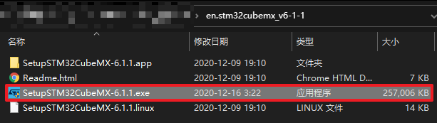

# STM32H750VBTx_Example
STM32H750VBTx 例程


# 一、开发环境

## 1. STM32Cube MCU包

固件库版本：STM32Cube_FW_H7_V1.8.0

下载地址：[https://www.st.com/zh/embedded-software/stm32cubeh7.html](https://www.st.com/zh/embedded-software/stm32cubeh7.html)


解压文件，到下图中路径“C:\Users\xxx\STM32Cube\Repository\STM32Cube_FW_H7_V1.8.0”，如无对应路径自己创建。


## 2. STM32CubeMX

版本：STM32CubeMX v6.1.1

下载地址：[https://www.st.com/content/st_com/en/products/development-tools/software-development-tools/stm32-software-development-tools/stm32-configurators-and-code-generators/stm32cubemx.html](https://www.st.com/content/st_com/en/products/development-tools/software-development-tools/stm32-software-development-tools/stm32-configurators-and-code-generators/stm32cubemx.html)


下载文件后，解压，运行“SetupSTM32CubeMX-6.1.1.exe”



默认安装即可


设置固件包路径，“Help”->“Updater Settings”->“Firmware Repository”->“Repository Folder”->“C:/Users/zhou/STM32Cube/Repository/”


## 3. Keil uVision5 v5.31.00

版本：Keil uVision5 v5.31.00

下载地址：[https://www.keil.com/download/product/](https://www.keil.com/download/product/)

[https://armkeil.blob.core.windows.net/eval/MDK531.EXE](https://armkeil.blob.core.windows.net/eval/MDK531.EXE)

默认安装

安装完成后不要打开，直接关闭。


## 4. Keil.STM32H7xx_DFP.2.7.0.pack

MDK软件支持包

版本：Keil.STM32H7xx_DFP.2.7.0.pack

下载地址：[https://www.keil.com/dd2/pack/](https://www.keil.com/dd2/pack/)

[https://keilpack.azureedge.net/pack/Keil.STM32H7xx_DFP.2.7.0.pack](https://keilpack.azureedge.net/pack/Keil.STM32H7xx_DFP.2.7.0.pack)


# 二、例子

## 1. 时钟配置

STM32Cube 是一个全面的软件平台，包括了ST产品的每个系列。平台包括了STM32Cube 硬件抽象层(一个STM32抽象层嵌入式软件，确保在STM32系列最大化的便携性)和一套的中间件组件(RTOS, USB, FatFs, TCP/IP, Graphics, 等等).

- 直观的STM32微控制器的选择和时钟树配置
- 微控制器图形化配置外围设备和中间件的功能模式和初始化参数
- C代码生成项目覆盖STM32微控制器的初始化符合IAR™，Keil的™和GCC编译器。


对于新的产品设计，我们强烈推荐使用STM32Cube来加速你的开发过程，并为以后的产品平台移植打下良好的基础。

### 1.新建工程
打开STM32cubeMX软件，点击“File”->“New Project”。选择对应MCU（STM32H750VBTx）。点击“Start Project”


### 2. RCC设置
​	“Categories”->“System Core”->“RCC”
​	HSE(外部高速时钟)选为Crystal/Ceramic Resonator(晶振/陶瓷谐振器)
​	LSE(外部低速时钟)选为Crystal/Ceramic Resonator(晶振/陶瓷谐振器)


```
- 选项 High Speed Clock（HSE）用来配置 HSE
- 选项 Low Speed Clock（LSE）用来配置 LSE
- 选项 Master Clock Output 1 用来选择是否使能 MCO1 引脚时钟输出
- 选项 Master Clock Output 2 用来选择是否使能 MCO2 引脚时钟输出
- 最后一个选项 Audio Clock Input（I2S_CKIN）用来选择是否从 I2S_CKIN(PC9)输入I2S 时钟。
- 要注意，因为选项 Master Clock Output 2 和选项 Audio Clock Input （I2S_CKIN）都是使用的 PC9 引脚，所以如果我们使能了其中一个，那么另一个选项会自动显示为红色，也就是不允许配置，这就是 STM32CubeMX 的自动冲突检测功能.
```


### 3. 时钟配置

点击“Clock Configuration”，进入时钟配置界面。

第一步配置系统时钟为400MHz。


```
1. 时钟源参数设置： HSE 或者 HSI 配置。这里我们选择 HSE 为时钟源，所以我们之前必须在 RCC 配置中我们开启 HSE。
2. 时钟源选择： HSE 还是 HSI。这里我们配置选择器选择 HSE 即可。
3. PLL 分频系数 M 配置。分频系数 M 我们设置为 3。
4. 主 PLL 倍频系数 N 配置。倍频系数 N 我们设置为 100。
5. 主 PLL 分频系数 P 配置。分频系数 P 我们配置为 2。
6. 系统时钟时钟源选择： PLL,HSI 还是 HSE。这里毫无疑问，我们选择 PLL，选择器选择 PLLCLK 即可。
7. 经过上面配置以后此时 SYSCLK=400Mhz。(24MHz / 3 * 100 / 2 = 400MHz)
```


第二步配置 AHB，APB1、APB2、 APB3、 APB4 和 Systick 的分频系数 


```
AHB、APB1、APB2、APB3 和 APB 总线时钟以及 Systick 时钟的最终来源都是系统时钟SYSCLK。
其中 AHB 总线时钟 HCLK 是由 SYSCLK 经过 AHB 预分频器之后的来，要设置 HCLK 为 200MHz，只需要配置图中左侧红框为 2 即可。
得到 HCLK 之后，接下来我们将在图中右侧红框处依次配置 APB3、 APB1、 APB2 和 APB4 分频系数分别为 2、 2、 2 和 2 即可。
注意！ systick 固定为 400MHz，配置完成之后，那么 HCLK=200MHZ， Systic=400MHz， PCLK1=100MHz， PCLK2=100MHz， PCLK3=100Mhz, PCLK4=100MHz。
```

### 4. Cortex-M7 内核基本配置  

第一个配置栏目 Cortex Interface Settings 下面有两个配置项：
	1) CPU ICache：使能 I-Cache。
	2) CPU DCache: 使能 D-Cache。
上面这 2 个参数是 CM7 内核相关配置。 第二个配置栏目 Cortex Memory Protection Unit，是用来配置内存保护单元 MPU。


### 5. 外设初始化为独立文件

“Proje Manager” -> “Generated files” -> “勾选Generated periphera initialization as a pair of '.c/.h' files per IP”。外设初始化为独立的C文件和头文件。


### 6. 配置生成的工程类型


至此配置完毕，保存工程。


## 2. IO输出

配置PA15闪烁

“Pinout & Configuration” -> “Categories” -> “System Core” -> “GPIO”，输入管脚号，找到管脚所在的位置


左键，设置IO为“GPIO_Output”模式。


进入 IO 口详细配置界面，界面会列出所有使用到的 IO 口的参数配置。选择PA15，就会在显示框下方显示对应的 IO 口详细配置信息，  


在 STM32CubeMX 操作界面右上角，点击 CREATE CODE 即可生成源码 ，打开工程。


增加代码，使LED闪烁


```c
    HAL_GPIO_WritePin(RUN_LED_GPIO_Port, RUN_LED_Pin, GPIO_PIN_SET);
    HAL_Delay(1000);
    HAL_GPIO_WritePin(RUN_LED_GPIO_Port, RUN_LED_Pin, GPIO_PIN_RESET);
    HAL_Delay(1000);
```

编译工程，选择下载器，下载程序运行。RUN_LED闪烁。

## 3. IO输入-轮询模式

## 4. IO输入-中断模式

## 5. 串口

## 6. 定时器

## 7. 独立看门狗

